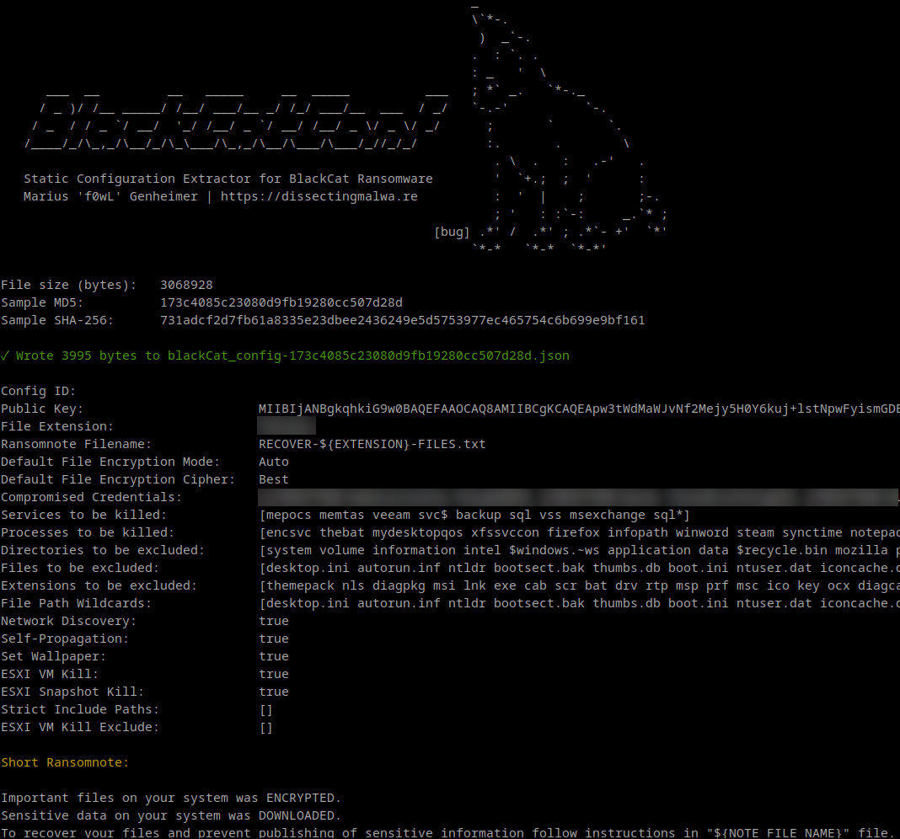

# blackCatConf

blackCatConf is a static configuration extractor implemented in Golang for the main component of DanaBot (targeting Microsoft Windows). By default the script will print the extracted information to stdout. It is also capable of dumping the malware configuration to disk as a JSON file with the ```-j``` flag.

### Usage 

```shell
go run blackcatconf.go [-j] path/to/blackcat_sample.bin
```

## Screenshots

<p align="center">

</p>

## Configuration structure

With these novel BlackCat Ransomware samples this config extractor could easily be replaced by a bash one-liner (e.g. strings ... | grep "{config_id" > config.json), but I expect that there will be config obfuscation/encryption added in future samples of BlackCat, similar to e.g. the changes made in Darkside Ransomware over time.

Speaking of Darkside/BlackMatteer: The configuration structure and values of BlackCat share significant similarities with those found in BlackMatter. The Korean Threat Intelligence company S2W Lab published [a thorough analysis of the similarities between these two Ransomware strains](https://medium.com/s2wlab/blackcat-new-rust-based-ransomware-borrowing-blackmatters-configuration-31c8d330a809).


## Testing

This configuration extractor has been tested successfully with the following samples:

|                             SHA-256                              |                     Sample                              |
| :--------------------------------------------------------------: | :-----------------------------------------------------: |
| 59868f4b346bd401e067380cac69080709c86e06fae219bfb5bc17605a71ab3f | [Malware Bazaar](https://bazaar.abuse.ch/sample/59868f4b346bd401e067380cac69080709c86e06fae219bfb5bc17605a71ab3f/) |
| 731adcf2d7fb61a8335e23dbee2436249e5d5753977ec465754c6b699e9bf161 | [Malware Bazaar](https://bazaar.abuse.ch/sample/731adcf2d7fb61a8335e23dbee2436249e5d5753977ec465754c6b699e9bf161/) |

If you encounter an error with blackCatConf, please file a bug report via an issue. Contributions are always welcome :)
