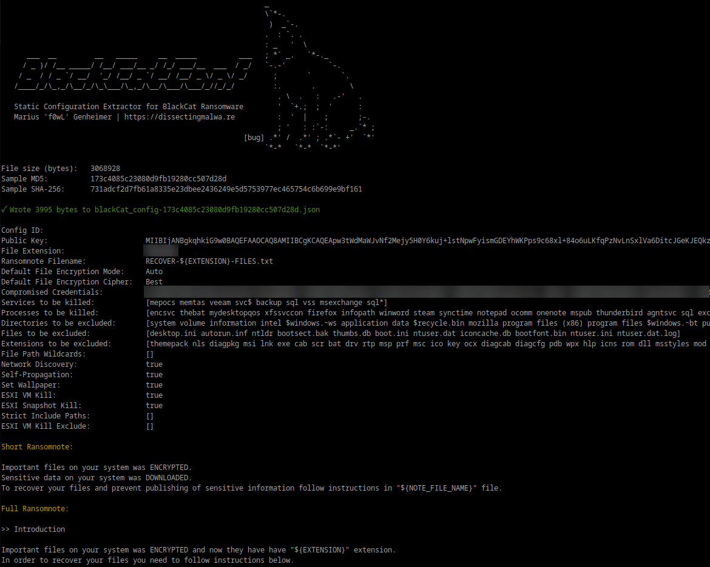

[](https://goreportcard.com/report/github.com/f0wl/blackCatConf)

# blackCatConf

blackCatConf is a static configuration extractor implemented in Golang for BlackCat Ransomware (targeting Microsoft Windows and GNU/Linux + VMware ESXi). By default the script will print the extracted information to stdout. It is also capable of dumping the malware configuration to disk as a JSON file with the ```-j``` flag.

### Usage 

```shell
go run blackcatconf.go [-j] path/to/blackcat_sample.bin
```

## Screenshots

Sensitive victim information in the screenshot below and the example config file has been redacted.

<p align="center">

</p>

## Configuration structure

With these novel BlackCat Ransomware samples this config extractor could easily be replaced by a bash one-liner (e.g. ```strings ... | grep "{\"config_id" > config.json```), but I expect that there will be config obfuscation/encryption added in future samples of BlackCat, similar to e.g. the changes made in Darkside Ransomware over time. If this is the case here as well having a structure to unmarshal the json config into will save me some time down the road.

Speaking of Darkside/BlackMatteer: The configuration structure and values of BlackCat share significant similarities with those found in BlackMatter. The Korean Threat Intelligence company S2W Lab published [a thorough analysis of the similarities between these two Ransomware strains](https://medium.com/s2wlab/blackcat-new-rust-based-ransomware-borrowing-blackmatters-configuration-31c8d330a809).


|             Key              |                     Value / Purpose                             |        Type         |
| ---------------------------- | --------------------------------------------------------------- | :-----------------: |
| config_id                    | Configuration ID, empty up until now (= Victim Identifier?)     | unknown             |
| public_key                   | RSA Public Key (Base64 encoded)                                 | string              |
| extension                    | Extension for encrypted files                                   | string              |
| note_file_name               | Filename of the Ransomnote                                      | string              |
| note_full_text               | Long version of the Ransomnote                                  | string              |
| note_short_text              | Short version of the Ransomnote                                 | string              |
| default_file_mode            | File Encryption Mode (observed: "auto" and "Smartpattern")      | string or []int     |
| default_file_cipher          | File Encryption Cipher (observed: "Best")                       | string              |
| credentials                  | Array of compromised credentials for escalation and propagation | [][]string          |
| kill_services                | List of services to be terminated                               | []string            |
| kill_processes               | List of processes to be terminated                              | []string            |
| exclude_directory_names      | Directories that are excluded from the encryption process       | []string            |
| exclude_file_names           | Files that are excluded from the encryption process             | []string            |
| exclude_file_extensions      | File extensions that are excluded from the encryption process   | []string            |
| exclude_file_path_wildcard   | Filepaths to be excluded via wildcard                           | []string  (?)       |
| enable_network_discovery     | Switch to enable/disable network discovery                      | bool                |
| enable_self_propagation      | Switch to enable/disable self propagation                       | bool                |
| enable_set_wallpaper         | Switch to enable/disable wallpaper change                       | bool                |
| enable_esxi_vm_kill          | Switch to enable/disable VM termination on ESXi Hosts           | bool                |
| enable_esxi_vm_snapshot_kill | Switch to enable/disable Snapshot deletion on ESXi Hosts        | bool                |
| strict_include_paths         | Hardcoded filepaths (likely victim-specific)                    | []string  (?)       |
| esxi_vm_kill_exclude         | Exclusion list for virtual machines on ESXi Hosts               | []string  (?)       |


## Testing

This configuration extractor has been tested successfully with the following samples:
|                             SHA-256                              |     OS     |                                                    Sample                                                          |
| :--------------------------------------------------------------: |:----------:| :----------------------------------------------------------------------------------------------------------------: |
| 59868f4b346bd401e067380cac69080709c86e06fae219bfb5bc17605a71ab3f |  Windows   | [Malware Bazaar](https://bazaar.abuse.ch/sample/59868f4b346bd401e067380cac69080709c86e06fae219bfb5bc17605a71ab3f/) |
| 731adcf2d7fb61a8335e23dbee2436249e5d5753977ec465754c6b699e9bf161 |  Windows   | [Malware Bazaar](https://bazaar.abuse.ch/sample/731adcf2d7fb61a8335e23dbee2436249e5d5753977ec465754c6b699e9bf161/) |
| 5121f08cf8614a65d7a86c2f462c0694c132e2877a7f54ab7fcefd7ee5235a42 |  Linux     | [VX-Underground](https://samples.vx-underground.org/samples/Families/BlackCatRansomware/linux/5121f08cf8614a65d7a86c2f462c0694c132e2877a7f54ab7fcefd7ee5235a42.7z) |
| f8c08d00ff6e8c6adb1a93cd133b19302d0b651afd73ccb54e3b6ac6c60d99c6 |  Linux     | [VX-Underground](https://samples.vx-underground.org/samples/Families/BlackCatRansomware/linux/f8c08d00ff6e8c6adb1a93cd133b19302d0b651afd73ccb54e3b6ac6c60d99c6.7z) |

If you encounter an error with blackCatConf, please file a bug report via an issue. Contributions are always welcome :)
